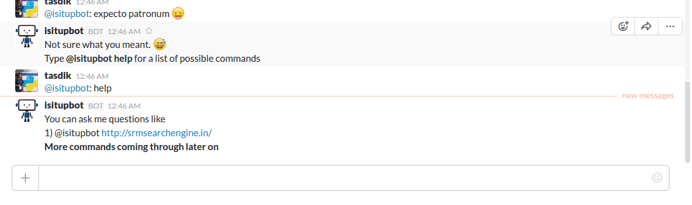

# margo

An opiniated Slack bot written for [SRMSE's](http://srmsearchengine.in/) [slack channel](https://srmsearch.slack.com/)



## Index

- [What does it do](#what-does-it-do)
- [App structuring](#app-structuring)
- [Installation](#installation)
    - [Clone it](#clone-it)
    - [Setting up the environment variables](#setting-up-the-environment-variables)
- [Bot not responding](#bot-not-responding)
- [Contributing](#contributing)
    - [TODO](#todo)
- [License](#license)
- [Donation)(#license)

## What does it do

[:arrow_up: Back to top](#index)

Margo will notify in realtime if the queried website is down or not. As it resides inside SRMSE's slack channel, check out whether our own web server is up or not! But yes you can **query for other domains too**

## App structuring

[:arrow_up: Back to top](#index)

All the `TOKENS` have been kept inside a single `settings.ini.example` file.

```sh

$ tree
.
├── assets
│   └── demo.gif
├── CONTRIBUTING.rst
├── LICENSE
├── Makefile
├── margo
│   ├── constants.py
│   ├── core.py
│   ├── helpers.py
│   ├── __init__.py
│   └── utils.py
├── Procfile
├── README.md
├── requirements.txt
├── run.py
├── scripts
│   ├── __init__.py
│   └── print_bot_id.py
└── settings.ini.example

```

## Installation

[:arrow_up: Back to top](#index)

### Clone it


Install the dependencies

```
$ virtualenv margo              # Create virtual environment
$ source margo/bin/activate     # Change default python to virtual one
(margo)$ git clone https://github.com/prodicus/margo.git
(margo)$ cd margo
(margo)$ make deps
```

**Deploying to Heroku**

Go to the [Bot users page](https://api.slack.com/bot-users) and create a new bot to get the `SLACK_BOT_TOKEN`

```sh
$ # create the heroku project
$ heroku create {project-name}
$ heroku config:set BASE_URL=https://isitup.org/
$ heroku config:set RESULT_FORMAT=json
$ heroku config:set SLACK_BOT_TOKEN=YOUR-SLACK-TOKEN
$ heroku config:set BOT_ID=YOUR-BOT-ID
$ # deploy it
$ git push -u heroku master
```

Check the logs for any errors by doing a `$ heroku logs -t`

### You need to get your Bot's ID too! How do you get it?

Run the script `print_bot_id.py` placed in inside the project directory `scripts`. Before running it, Change the the variable `BOT_NAME` to the bot name you chose for your case

```sh
$ make bot_id
```

And then place put it inside the `settings.ini` or the heroku environment (whatever you chose)

## Running it locally

Setting up the environment variables

```sh
(margo)$ cp settings.ini.example settings.ini
```

and add the required values like `SLACK_BOT_TOKEN` and `BOT_ID`

```sh
(margo)$ make run
```

Open you slack channel and start talking to your bot

## Bot not responding

So the thing with heroku and it's basic plan is that, the dyno sleeps after some inactivity. Visit [http://margo-slackbot.herokuapp.com/](http://margo-slackbot.herokuapp.com/) to wake up the bot!

## Contributing

[:arrow_up: Back to top](#index)

Refer [CONTRIBUTING.rst](https://github.com/prodicus/margo/blob/master/CONTRIBUTING.rst) for details

### TODO

- [ ] Make `margo` query a website in intervals and notify when it goes down!

## License

[:arrow_up: Back to top](#index)

Built with ♥  and [vim](http://www.vim.org) by [Tasdik Rahman](http://tasdikrahman.me/) [(@tasdikrahman)](https://twitter.com/@tasdikrahman)

Open sourced under GPLv3

You can find a copy of the License at [LICENSE](https://github.com/prodicus/margo/blob/master/LICENSE)

## Donation

[:arrow_up: Back to top](#index)

If you have found my little bits of software being of any use to you, do consider helping me pay my internet bills :)

| £ (GBP) | <a href="https://transferwise.com/pay/d804d854-6862-4127-afdd-4687d64cbd28" target="_blank"></a> |
|:-------------------------------------------:|:-------------------------------------------------------------:|
| € Euros | <a href="https://transferwise.com/pay/64c586e3-ec99-4be8-af0b-59241f7b9b79" target="_blank"></a> |
| ₹ (INR)  | <a href="https://www.instamojo.com/@tasdikrahman" target="_blank"></a> | 
